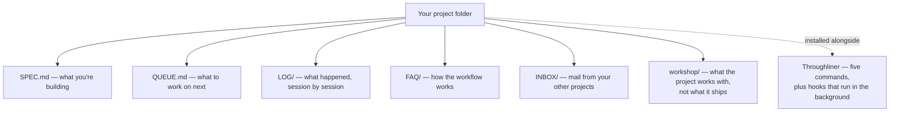
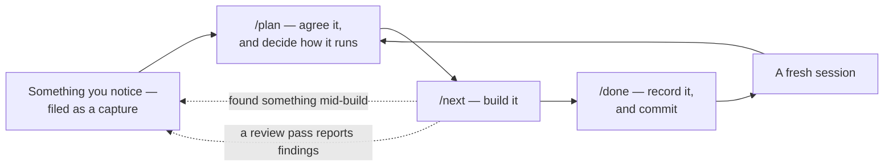
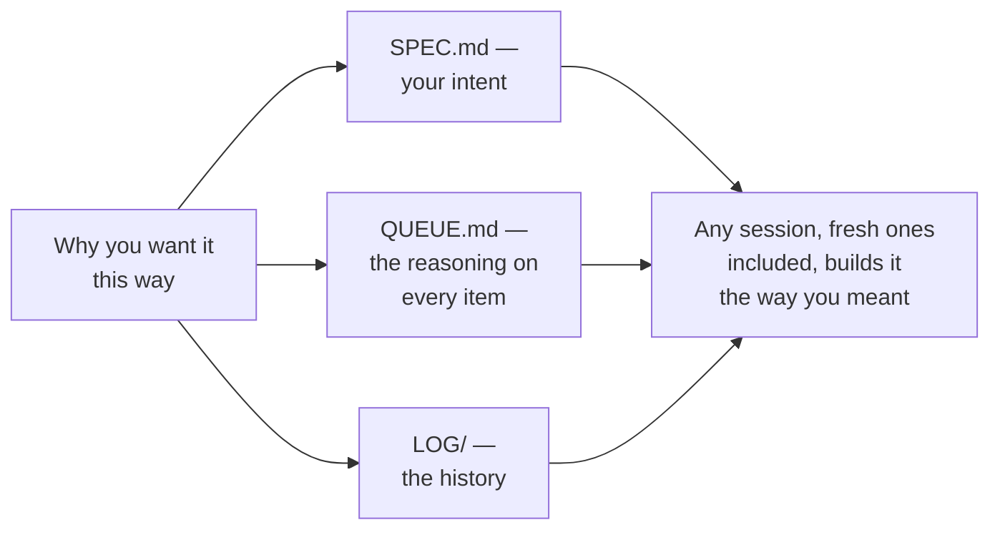

# Throughliner

A Claude Code plugin that lets you build the project you have in mind — an app, a website, a tool, whatever you're making — without writing code yourself. You describe what you want; Claude builds it — and the plugin keeps the work organised across sessions so nothing drifts or gets lost.

**What makes it different: Intent and reasoning are read while Claude is planning and building, so the throughline shapes every decision quietly rather than only when you ask "why is this like this?" The log is the deep archive, pulled up when you need it.

What this means:
- settled things stop being re-decided, because a rejected option's reason for losing is on the record and doesn't get re-proposed. 
- Silent regressions get caught, because you can see why something is the way it is before changing it. 
- You can come back after a break — or hand the project to someone else — and the reasoning is still there. 

## Install [note to claude: [we need to keep this section in cync with the instructions in the discord]]

### New to Claude Code? Start here

Open a fresh chat at [claude.ai](https://claude.ai), paste this link — `https://github.com/FlintcraftTech/throughliner/raw/main/INSTALL.md` — and ask Claude to **read the guide and walk you through it step by step**. Asking Claude to read it is the part that matters: the guide is written to be followed exactly, and a Claude that improvises from the link alone will skip steps it cannot see.

The guide covers installing Claude Code, setting up a paid plan, and installing the plugin. It assumes no terminal experience: the two install commands are the only terminal step, and the guide gives them one at a time with what each prints.

### Already have Claude Code?

The install is two commands run in a terminal — the desktop app has no menu that adds a marketplace. With the `claude` command-line tool installed (check with `claude --version`), run `claude plugin marketplace add FlintcraftTech/throughliner#stable` and then `claude plugin install throughliner@flintcraft`. Then fully restart Claude Code so the plugin loads. To update later, run `claude plugin update throughliner@flintcraft`, then restart again — you'll pick up the newest beta each time.

**Why `#beta`?** That's the tested weekly pick — the version we're happy for people to run. The plugin's main line carries day-to-day development and can change under you mid-week, so `#beta` is the one to install unless you specifically want the newest unfinished work.

### What the beta channel is

Once a week — on a Wednesday — one build gets put on the beta channel. So the version you install has been lived in, not just compiled.

Updates arrive when you ask for them. Ask Claude to update the plugin to the current beta and fully restart Claude Code. If you'd rather be told when a new one lands, the Watch setting in [Get notified of new versions](#get-notified-of-new-versions) below emails you.

If something breaks, say so — either on the [Discord](https://discord.gg/Z7ftKnSjR) or by telling Claude in your own project, which knows how to file a report and will show you the text before anything is sent.

### Coming from Sovereign Implementer?

That was this plugin's old name. Claude Code follows the old name to the new one automatically and rewrites its own settings, but it still needs fetching under the new name — so install `throughliner@flintcraft` once and fully restart. Everything in your projects stays where it is. (The automatic follow-along needs Claude Code 2.1.193 or newer.)

## Get notified of new versions

Want an email when a new version ships? GitHub can send you one. On the [plugin's GitHub page](https://github.com/FlintcraftTech/throughliner), click **Watch** (near the top right), choose **Custom**, tick **Releases**, and click **Apply**. From then on you get an email each time a new release is published. This needs a free GitHub account — signing up costs nothing.

## Who it's for

No-code developers who know what their project should do but need a framework to keep Claude on track through multi-session builds.

## What a project looks like

Setup gives your project folder a small set of plain-text documents, alongside the plugin itself:

`LOG/` and `workshop/resources/` are historical records — they keep the vocabulary and the state of the day each entry was written, so an old one may describe things that have since changed. SPEC.md and this README describe the present.

## What it does

The plugin splits your project into a build queue and walks you through it. Five slash commands drive the workflow:

- `/setup` — interviews you about your project (adapting to your answers) and scaffolds everything. While scaffolding it proposes keeping your planning documents out of the repository entirely, since they hold your plans, reasoning and history and are the ones most likely to contain something you didn't mean to publish — that's the configuration it offers you by default, per document, and you can choose to have them tracked instead. Keeping them private no longer costs you undo: before changing one of these documents Claude saves a copy of the previous version into a local folder that also stays out of the repository, so an unwanted change can be put back. Those copies live on your machine only and carry no history, so a lost disk loses them. It also offers a **brevity style** for the project — a setting that keeps Claude's replies short and decision-led, which matters more and more as the method's documents accumulate around your project. If you ask for a public repository it sets one up and asks about a licence at that point — never earlier, because a licence is a real question only once the code is going somewhere public
- `/plan` — organise the queue, capture ideas, resolve design questions
- `/next` — build the next piece of ready work, scope-locked so Claude stays focused; it can build several pieces of cleared work back-to-back without you confirming each one, and it works through everything you've marked ready rather than proposing to stop early
- Work can be tagged so `/next` treats it differently: a **review pass** that reads and reports without editing, a **step for you** that Claude walks you through live rather than doing itself, **hands-off** work that Claude must not run from the queue at all — work you and Claude do by hand in a session of its own, because it's large or because it can't run inside a build run (repairs to the plugin's own machinery are one example, where using a broken mechanism to fix itself is the risk) — or a **co-write**, a text you and Claude finish together in one named file, handed to you to edit and read back until you say it's done
- `/rescan` — look back over the conversation for anything you decided or noticed but never wrote down, and file it in the queue. Run it whenever you like, as often as you like: it only looks back as far as the last time you ran it, so it never repeats itself. It files things; deciding what happens to them is still `/plan`'s job
- `/done` — record what happened, commit. It tells you what's next and stops there, rather than inviting you straight into another build in the same conversation — a fresh one works better, and a message ending in a command is easy to send by accident. If you carry on working afterwards and something changes, it offers once to add that to the session's record
- If you ask for something mid-build that isn't part of the current job, Claude writes it into your queue and says why rather than silently deferring it — and if you ask a second time, a small change gets done there and then

A new project is set up **nested**: your product lives in a subfolder with a clean git repository of its own — the one that goes public if you ever publish — while the planning documents stay tracked in an outer repository that never leaves your machine. You get undo and history for everything, and a visitor to your published code sees the product, not the workshop. `/done` commits both. An existing flat project is never forced over; the conversion is offered at setup and again at the moment you go public, which is when the layout starts to matter. Setup also asks, roughly, what your project's moving parts are and which of them are the product: each part gets its own folder — product parts in the public-facing repository, everything else in the private one — written into your project's CLAUDE.md so later sessions know where a new file belongs. Where a part could be either, setup asks rather than deciding. Each part also gets its own small SPEC.md beneath the main one, so a build reads only the spec for the part it is working on, and a part that later pops out into its own project takes its spec with it.

Running the method on a tool other than Claude Code is supported, and a port says which of two flavours it is: **tracking** (takes this project's changes as they come, adding nothing beyond what its own system needed to fit) or **independent** (its own thing, adopting only the changes it wants). Both are welcome, and saying which is what lets anyone tell what a port promises — see [plugin/throughliner/docs/ports.md](plugin/throughliner/docs/ports.md).

Hooks run automatically in the background to enforce discipline — locking edits to the active work's file list, guarding git safety, and linting the queue structure so it stays well-formed. They also notice when your project's documents have fallen behind the current version of the method: rather than carrying on and quietly getting things wrong, the session stops and offers to bring them up to date with `/setup`, which migrates what's there instead of replacing it. They also stop Claude writing to your files by running a script instead of using its editing tools: a shell command can be working from an out-of-date view of a file and quietly overwrite something, so that route is closed off entirely.

At the start of a session they also tell you **whether this conversation's work can reach your machine directly** — worked out from git rather than assumed. A conversation in its own copy of the project, or one running in the cloud, keeps its work on a branch that has to come back, and you're told so at the start rather than discovering it later. And they name any **working file left behind by a conversation that never closed**, without deleting it: that file can be the only record of what a crashed session actually did.

Where your app gives each conversation its own copy of the project, they also point out **work sitting on a branch that hasn't been merged back**, and offer to merge it. Nothing merges on its own, and an isolated conversation warns you at its close that the app's "remove" option at exit would delete that work along with the copy.

`/plan` opens by checking your queue for work whose position disagrees with what the work itself says — something marked ready that its own notes say must not be built, something marked ready with no files to change, or a chain of work each waiting on something else that is also waiting. It reports what it finds and moves nothing; that decision stays yours.

And they check Claude's own reports. Claude writes to your queue first and tells you after, which keeps the write safe — but it means a reply could report filing something the write never actually made, and you'd have no way to tell. So when a reply says a named piece of work was filed, a hook checks your queue for it, and if it isn't there Claude is made to fix it and tell you plainly before you act on it.

When something goes wrong, Claude works out which of three things it was and sends it to the right place: your **app** stays as work in your own queue; a problem with **the method** goes to the plugin's author at flintcraft.tech/report — or, if you happen to have the plugin's own project on your machine and have told Throughliner about it, straight into that project's mailbox instead, which keeps it off the public web; a problem with **Claude Code itself** goes to a GitHub issue on `anthropics/claude-code`. Both outward reports are scrubbed of your project's details, and nothing is ever sent without you seeing the exact text first.

If you run more than one project on the method, they can **message each other** — durable, offline, approval-gated mail, where Claude Code's own session messaging reaches only sessions open right now. Each project gets an `INBOX/` folder, and anything waiting in yours is mentioned at the start of a session — no carrying notes between chats by hand. Mail is opened at the start of a planning session and at the start of a build run, so a message that affects something about to be built can still change what runs. A message going out to another project is always shown to you for approval first, because it carries this project's content somewhere else. Sending places the message in the other project's mailbox and nothing confirms it was read — that limit is stated rather than glossed over, and Claude checks the other project has a mailbox at all before writing. The first folder path you give for a project is remembered, inside the `INBOX/` folder that git ignores, so continuing a conversation doesn't mean digging the path out again.

Every project also gets a **`workshop/` folder** — the place for what the project works with rather than what it ships. Research findings and re-read-later testing evidence live in `workshop/resources/`, alongside anything else you keep but don't publish: post drafts, article drafts, reference material. The point is what someone landing on your repository sees first — your product and your project's own documents stay in view, and everything they merely refer to sits in one folder that can be skipped. Beside it sits a **`temp/` folder**, kept out of git, for what a session brings in and may throw away — a fetched transcript, a file downloaded to read once, a draft that never became anything — so odds and ends stop landing in your mailbox or your workshop.

Where a step has you editing something Claude drafted, the draft is handed over as a file you edit yourself rather than as chat text you describe changes to — Claude reads it back when you say so, asks whether there's more, and repeats until you're done.

The record of everything your project has sent — the one-line index inside your mailbox — is guarded the same way. That folder is deliberately kept out of git, because it holds other projects' folder paths, so unlike every other document it has no history to restore from: writing over the whole file, or deleting it from the command line, is refused. Adding a line and changing one pass through untouched.

They also publish an **editing-state signal**: while Claude is writing to a file, a small marker in a `.throughliner/` folder says so, so another app you have open on the same document can hold off rather than the two of you typing over each other. It's a published contract other applications can read — the field-level specification is in [EDITING-STATE-CONTRACT.md](EDITING-STATE-CONTRACT.md) — it fails open where the plugin isn't installed, and the folder is gitignored, so it's safe to delete at any time.

## How to use it

Run **/setup** once, when you first set up a project. After that you work in sessions, and every session ends the same way: **/done** to record what happened, then **/clear** to start fresh.

- **/plan** — think and organise: manage the queue, add ideas, resolve questions. Run it as often as planning needs; a long planning stretch is just /plan → /done → /clear, repeated.
- **/next** — build: it picks the top piece of ready work and builds it. You'll run /next many times, working down the queue. When several pieces are cleared, one /next can build them back-to-back without you confirming each one.

The habit that matters: always /done before /clear, so each session is saved before the context resets.

Every piece of work travels the same loop, and two things can send you back to the start of it:

## How the why travels

The reasoning behind a decision is carried alongside the work rather than kept in one place — which is what the plugin is named for:

## Operating conditions

**Prerequisites** — do these once per project:
- Run `/setup` in your project folder to scaffold the method docs

**Optional software that unlocks a capability** — not needed to use the plugin:
- `gh`, GitHub's command-line tool. If you have it and you're signed in, Claude can file a Claude Code bug report for you directly (after showing you the text and asking). Without it everything still works — Claude writes the report out and you paste it on GitHub yourself.

**Tested environment** — the plugin is developed and tested under these settings. Other configurations may work but aren't verified:
- Claude Opus 5 and Fable 5, all effort levels tested OK
- Auto mode enabled — optional; it spares you approving each step by hand. Turn it off if you'd rather confirm each action.
- `/clear` after every `/done` (keeps each session's context clean)

## Getting started

Open any project folder in Claude Code and run `/setup`. The plugin asks a short questionnaire about what you're building, then scaffolds your project docs. When you're ready to build, run `/plan` to organise your first piece of work, then `/next` to start.

## License

See [LICENSE](LICENSE).
