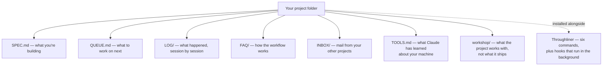
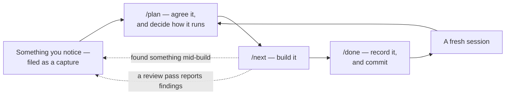
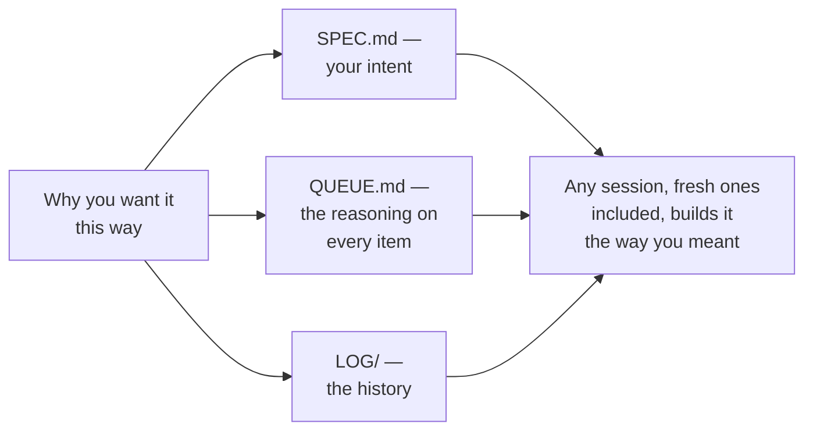

# Throughliner

A Claude Code plugin for people who build things without writing code. You say what you want. Claude builds it. Throughliner keeps the work organised across sessions, so nothing drifts and nothing gets lost.

## What makes it different

Every project on Throughliner keeps a written record of *why* things are the way they are. That record is read while Claude plans and builds, not only when you ask. So a fresh session, with no memory of the last one, still builds what you meant.

What you get from that:

- Settled things stay settled. A rejected idea carries the reason it lost, so it does not come back.
- Silent regressions get caught. Before something changes, the reason it exists is there to read.
- You can come back after a break, or hand the project to someone else, and the reasoning is still there.

## Install

### New to Claude Code? Start here

Open a fresh chat at [claude.ai](https://claude.ai). Paste this link: `https://github.com/FlintcraftTech/throughliner/raw/main/INSTALL.md`. Ask Claude to **read the guide and walk you through it step by step**. Asking Claude to read it matters. The guide is written to be followed exactly, and a Claude that improvises from the link alone will skip steps it cannot see.

The guide covers installing Claude Code, setting up a paid plan, and installing the plugin. It assumes no terminal experience. The terminal is used for three quick checks first: that Python is installed, that the `claude` tool is installed, and that GitHub's `gh` tool is installed and signed in. Then come the two install commands. The guide gives each one on its own, with what it prints when it works.

### Already have Claude Code?

The install is two commands run in a terminal. The desktop app has no menu that adds a marketplace. First check that the `claude` command-line tool is installed by running `claude --version`. Then run `claude plugin marketplace add FlintcraftTech/throughliner#stable`, and after it `claude plugin install throughliner@flintcraft`. Then fully restart Claude Code so the plugin loads.

To update later, run `claude plugin marketplace update flintcraft` and then `claude plugin update throughliner@flintcraft`. Restart again. Each update brings the newest weekly release.

### What you install

A default install gets the **stable channel**. That is the weekly release, published on a Wednesday. It was the previous week's beta, so testers have lived in it for a week before it reaches you. Testers who want the coming release a week early install with `#beta` instead of `#stable`. The plugin's main line carries day-to-day development and can change under you mid-week, so it is not the one to install.

Updates arrive when you ask for them. Run the two update commands above and restart, or ask Claude to run them for you. If you would rather be told when a new one lands, see [Get notified of new versions](#get-notified-of-new-versions) below.

If something breaks, say so. Tell Claude in your own project, which knows how to file a report and shows you the text before anything is sent. Or say so on the [Discord](https://discord.gg/Z7ftKnSjR).

### Coming from Sovereign Implementer?

That was this plugin's old name. Claude Code follows the old name to the new one and rewrites its own settings. It still needs fetching under the new name, so install `throughliner@flintcraft` once and fully restart. Everything in your projects stays where it is. The automatic follow-along needs Claude Code 2.1.193 or newer.

## Get notified of new versions

GitHub can email you when a new version ships. On the [plugin's GitHub page](https://github.com/FlintcraftTech/throughliner), click **Watch** near the top right. Choose **Custom**, tick **Releases**, and click **Apply**. From then on you get an email for each new release. This needs a free GitHub account.

## Who it's for

People who know what their project should do but need a framework to keep Claude on track through a build that spans many sessions.

## What a project looks like

Setup gives your project folder a small set of plain-text documents. The plugin sits alongside them.

`LOG/` and `workshop/resources/` are historical records. Each entry keeps the words and the state of the day it was written, so an old one may describe things that have since changed. SPEC.md and this README describe the present.

## What it does

The plugin splits your project into a build queue and walks you through it. Six slash commands drive the workflow.

- `/setup` interviews you about your project and scaffolds everything. It asks, roughly, what your project's moving parts are and which of them are the product. Each part gets its own folder and its own small SPEC.md. It also offers a **brevity style** for the project, a setting that keeps Claude's replies short and decision-led. If you ask for a public repository it sets one up and asks about a licence then, never earlier.
- `/plan` organises the queue: it captures ideas, resolves design questions and checks for drift. When the queue is empty and your spec describes things not yet built, it offers to turn the spec into a first set of items to weigh. You choose the level of detail.
- `/next` builds the next piece of ready work, locked to that work's files so Claude stays focused. It builds several cleared pieces back-to-back without you confirming each one. It works through everything you marked ready rather than proposing to stop early.
- `/rescan` looks back over the conversation for anything you decided or noticed but never wrote down, and files it in the queue. It only looks back as far as the last time you ran it, so it never repeats itself.
- `/done` records what happened and commits. It tells you what's next and stops there. If you carry on working afterwards and something changes, it offers once to add that to the session's record. It can also leave the next planning session a one-line piece of advice, which that session reads and clears.
- `/catchup` is for coming back after time away. It gives one line per feature in your spec with where it stands: shipped, ready to build, waiting, still an idea, or untouched. Then what a build would do next, what is waiting on you, and what is held on a date. It files nothing and moves nothing. Run it after a planning or build session has opened, and it reuses what that opening read.

Work can be tagged so `/next` treats it differently. A **review pass** reads and reports without editing. A **step for you** is one Claude walks you through live, one step at a time, rather than doing itself. **Hands-off** work is something Claude must not run from the queue at all. You and Claude do it by hand in a session of its own. A **co-write** is a text you and Claude finish together in one named file. It is handed to you to edit and read back until you say it is done. Work that would move files under a running build is marked to **run alone**. A build run stops in front of it and says why.

If you ask for something mid-build that is not part of the current job, Claude writes it into your queue and says why. If you ask a second time, a small change gets done there and then.

**Recurring work** can be defined once. A weekly release, a posting rhythm, a maintenance pass: each is written down as a cycle. At each planning or build opening the plugin says what is due and puts it in the queue. A **checklist** is a named step list with no schedule, run when you say its word.

**What Claude learns about your machine** is written to `TOOLS.md`. A tool that works at a known path, a command that fails from Claude's shell: once learned, no later session has to rediscover it.

A new project is set up **nested**. Your product lives in a subfolder with a clean git repository of its own, the one that goes public if you ever publish. Your planning documents stay tracked in an outer repository that never leaves your machine. You get undo and history for everything, and a visitor to your published code sees the product, not the workshop. `/done` commits both. An existing flat project is never forced over; the conversion is offered at setup and again when you go public.

If you would rather keep a planning document out of git entirely, `/setup` offers that per document. Before changing such a document, Claude saves a copy of the previous version into a local folder that also stays out of the repository. An unwanted change can be put back from it. Those copies live on your machine only and carry no history, so a lost disk loses them.

A part that outgrows its folder can be set up as a **project of its own** from inside. The two then talk by mail.

**Hooks** run in the background to enforce discipline. They lock edits to the active work's file list, guard git safety, and lint the queue so it stays well-formed. They notice when your project's documents have fallen behind the current version of the method, and offer to bring them up to date with `/setup`. It migrates what is there instead of replacing it. They stop Claude writing to your files through a shell script instead of its editing tools. A script can work from an out-of-date view of a file and quietly overwrite something.

At the start of a session they tell you **whether this conversation's work can reach your machine directly**, worked out from git. A conversation in its own copy of the project, or one running in the cloud, keeps its work on a branch that has to come back. They also name any **working file left behind by a conversation that never closed**, without deleting it. That file can be the only record of what a crashed session did.

`/plan` opens by checking your queue for work whose position disagrees with what the work itself says. Something marked ready that its own notes say must not be built, or a chain of work each waiting on something else that is also waiting. It reports what it finds and moves nothing.

Claude writes to your queue first and tells you after. So when a reply says a named piece of work was filed, a hook checks your queue for it. If it is not there, Claude is made to fix it and tell you plainly before you act on it.

**When something goes wrong**, Claude works out which of three things it was and sends it to the right place. Your **app** stays as work in your own queue. A problem with **the method** goes to the plugin's author. If you have the plugin's own project on your machine and have told Throughliner about it, the report goes into that project's mailbox. Otherwise, where the `gh` tool is installed and you agree, it goes as a GitHub issue on the plugin's repository. That issue is public under your own account. Otherwise, or wherever you prefer privacy, it goes to flintcraft.tech/report. A problem with **Claude Code itself** goes to a GitHub issue on `anthropics/claude-code`. Both outward reports are scrubbed of your project's details, and nothing is sent without you seeing the exact text first.

If you run more than one project on the method, they can **message each other**. Each project gets an `INBOX/` folder, and anything waiting in yours is mentioned at the start of a session. A message going out is always shown to you first. Sending places the message in the other project's mailbox and nothing confirms it was read.

Every project also gets a **`workshop/` folder** for what the project works with rather than what it ships: research, testing evidence, drafts. Beside it sits a **`temp/` folder**, kept out of git, for what a session brings in and may throw away.

Where a step has you editing something Claude drafted, the draft is handed over as a file you edit yourself. Claude reads it back when you say so, asks whether there is more, and repeats until you are done.

While Claude is writing to a file, a small marker in a `.throughliner/` folder says so. Another app open on the same document can then hold off. The specification is in [EDITING-STATE-CONTRACT.md](EDITING-STATE-CONTRACT.md).

## Ports

Running the method on a tool other than Claude Code is supported. A port says which of two flavours it is. **Tracking** takes this project's changes as they come. **Independent** is its own thing, adopting only the changes it wants. Both are welcome. Each release comes with a changelog written for ports, [PORT-CHANGELOG.md](PORT-CHANGELOG.md). The flavours are described in [plugin/throughliner/docs/ports.md](plugin/throughliner/docs/ports.md). If what you are building is itself a method, plugin or port, setup can lay in the discipline this project uses to author its own rules.

## How to use it

Run **/setup** once, when you first set up a project. After that you work in sessions. Every session ends the same way: **/done** to record what happened, then **/clear** to start fresh.

- **/plan** to think and organise. Run it as often as planning needs.
- **/next** to build. When several pieces are cleared, one run builds them back-to-back.

The habit that matters: always /done before /clear, so each session is saved before the context resets.

## How the why travels

The reasoning behind a decision is carried alongside the work rather than kept in one place. That is what the plugin is named for.

## Operating conditions

**Prerequisites**:
- Python 3 and the `claude` command-line tool, checked by the install guide.
- `gh`, GitHub's command-line tool, signed in. Setup checks for it. It is how the plugin checks once a week for a newer version on your channel, and how Claude files a problem report on the plugin's own repository, or a Claude Code bug report, after showing you the text. Without it the plugin still runs, but your project will not receive method updates.
- Run `/setup` once in your project folder to scaffold the method docs.

**Tested environment**:
- Claude Opus 5 and Fable 5, all effort levels.
- Auto mode enabled. Optional; it spares you approving each step by hand.
- `/clear` after every `/done`.

## Getting started

Open any project folder in Claude Code and run `/setup`. The plugin asks a short questionnaire about what you are building, then scaffolds your project docs. When you are ready to build, run `/plan` to organise your first piece of work, then `/next` to start.

## License

See [LICENSE](LICENSE).
